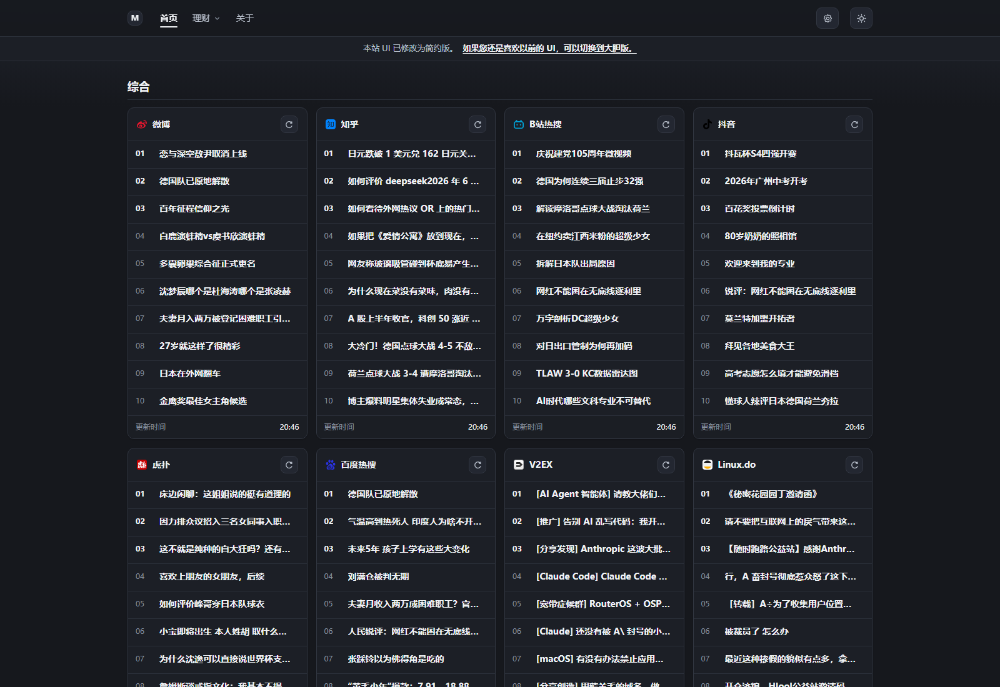
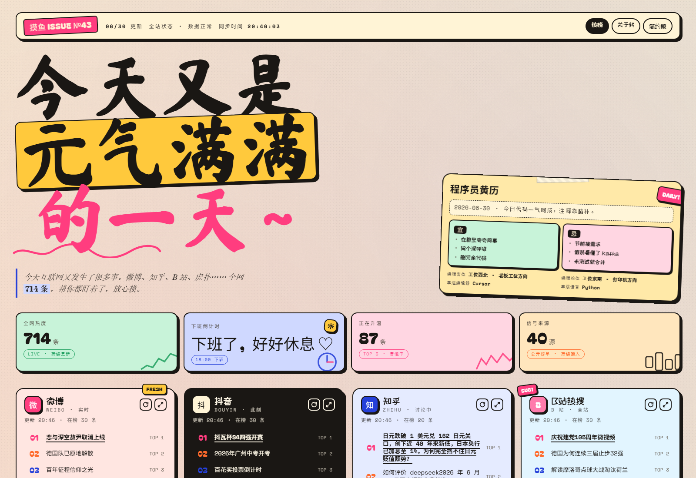

# 摸鱼热榜

> 面向自部署的中文公开热榜聚合面板。聚合热榜、开发者社区与市场快照，提供统一 Web UI 和 HTTP API。

[](./LICENSE)
[](https://astro.build/)
[](https://fastapi.tiangolo.com/)
[](./ops/docker-compose.yml)

摸鱼热榜把多个公开榜单和行情数据整理成一个轻量入口：打开首页即可快速扫过中文互联网热点、开发者社区动态、GitHub 趋势和市场概览。项目只展示标题、排名、热度、更新时间和原站链接，不抓取正文、图片、评论或用户数据。

- 在线体验：[moyuhot.com](https://moyuhot.com/)
- 项目仓库：[z1991817/moyuhot](https://github.com/z1991817/moyuhot)
- 上游热榜数据：[nostalgiatan/SeeSea](https://github.com/nostalgiatan/SeeSea)

## 界面预览

**普通版**



**大胆版**



普通版适合浏览器起始页、内网首页和工位信息面板；大胆版保留更强的视觉识别度，适合公开演示和分享。

## 能力概览

- 多源热榜：微博、知乎、B 站、抖音、V2EX、GitHub Trending、Hacker News 等公开榜单。
- 统一 API：前端不直连上游，所有数据先经过 FastAPI 清洗、缓存和字段映射。
- 市场快照：美股指数、热门美股、A 股指数与市场概览。
- 两套首页：默认普通版 `/`，视觉强化版 `/bold`。
- 缓存兜底：SQLite 保存快照，上游短时不可用时尽量返回旧数据。
- 一键部署：提供完整 Docker Compose 栈，可同时启动 SeeSea、API、前端和 Nginx。

## 架构

```text
Browser
  │
  ▼
Nginx :18081
  ├── Astro frontend :4321
  └── FastAPI backend :8000
        ├── SQLite cache
        ├── SeeSea HTTP API
        ├── Sina / Tencent market endpoints
        └── OpenTDX
```

| 模块 | 技术栈 |
| --- | --- |
| 前端 | Astro 5, TypeScript, CSS, pnpm |
| 后端 | FastAPI, Pydantic v2, httpx, APScheduler, SQLite |
| 热榜上游 | SeeSea HTTP API |
| 美股数据 | 新浪财经 / 腾讯财经公开行情接口 |
| A 股数据 | OpenTDX |
| 部署 | Docker Compose, Nginx |

## 快速开始

环境要求：

- Docker 24+
- Docker Compose v2
- 可访问互联网，用于拉取镜像、安装依赖和访问公开数据源

拉取源码：

```bash
git clone https://github.com/z1991817/moyuhot.git
cd moyuhot
```

### 完整 Docker Compose 栈

适合第一次体验、本地演示、个人服务器和内网部署。这个命令会同时启动 SeeSea、摸鱼热榜 API、Astro 前端和 Nginx。

```bash
docker compose -f ops/docker-compose.yml -f ops/docker-compose.full.yml up -d --build
```

打开：

```text
http://127.0.0.1:18081/
```

健康检查：

```bash
curl http://127.0.0.1:18081/healthz
```

停止：

```bash
docker compose -f ops/docker-compose.yml -f ops/docker-compose.full.yml down --remove-orphans
```

### 接入已有 SeeSea 服务

如果你已经单独部署了 SeeSea，或者希望在生产环境里独立维护上游服务，可以只启动摸鱼热榜本身。

```bash
cp ops/.env.example ops/.env
```

Windows PowerShell：

```powershell
Copy-Item ops\.env.example ops\.env
```

然后在 `ops/.env` 中设置 `SEESEA_BASE_URL`。

后端运行在 Docker 中、SeeSea 运行在宿主机时：

```dotenv
SEESEA_BASE_URL=http://host.docker.internal:18080
PUBLIC_SITE_URL=http://127.0.0.1:18081
```

后端直接运行在宿主机时：

```dotenv
SEESEA_BASE_URL=http://127.0.0.1:18080
```

启动摸鱼热榜：

```bash
docker compose -f ops/docker-compose.yml up -d --build
```

Windows 也可以使用辅助脚本：

```powershell
.\ops\restart.ps1 -Mode docker -Build
```

## 配置

`ops/docker-compose.yml` 会读取 `ops/.env`。常用配置如下：

| 变量 | 默认值 | 说明 |
| --- | --- | --- |
| `MOYU_NGINX_PORT` | `127.0.0.1:18081` | 对外访问入口。 |
| `MOYU_FRONTEND_PORT` | `127.0.0.1:14321` | Astro 容器端口，通常只用于调试。 |
| `MOYU_API_PORT` | `127.0.0.1:18000` | FastAPI 容器端口，便于本地调试接口。 |
| `SEESEA_PORT` | `127.0.0.1:18080` | 完整 Compose 栈中暴露的 SeeSea 端口。 |
| `SEESEA_BASE_URL` | `http://host.docker.internal:18080` | SeeSea HTTP API 地址。 |
| `PUBLIC_SITE_URL` | `https://moyuhot.com` | 站点公开地址，用于 canonical 和 SEO 元信息。 |

注意：

- 不要提交真实的 `ops/.env`。
- 如果部署到公网，只建议暴露 Nginx；SeeSea 和内部服务端口应保持私有。
- 正式部署前，把 `PUBLIC_SITE_URL` 改成你的真实域名。

## API

默认 Nginx 配置下，API base URL 为：

```text
http://127.0.0.1:18081/api
```

| 接口 | 说明 |
| --- | --- |
| `GET /healthz` | 服务健康检查 |
| `GET /api/home` | 首页聚合数据 |
| `GET /api/trends?platform=weibo` | 单个平台热榜 |
| `GET /api/sources` | 可用来源和最新状态 |
| `GET /api/market/us` | 美股指数 |
| `GET /api/market/us/stocks` | 热门美股 |
| `GET /api/market/cn` | A 股市场快照 |

首页数据会被规范化为稳定字段：

```text
platform / platformName / title / url / rank / heat / source / updatedAt
```

## 数据来源

热榜数据来自独立运行的 [SeeSea](https://github.com/nostalgiatan/SeeSea) HTTP 服务。当前使用的接口包括：

- `GET /api/hot/platforms`
- `GET /api/hot/{platform}`
- `GET /api/hot/multiple`

行情数据来自公开接口和开源库：

- 美股指数与热门美股：新浪财经 / 腾讯财经公开行情接口。
- A 股市场快照：OpenTDX。

行情数据仅用于信息展示，不构成投资建议。

## 本地开发

前端：

```bash
cd frontend
pnpm install
pnpm check
pnpm build
```

后端：

```bash
cd backend
python -m venv .venv
pip install -e ".[dev]"
ruff check .
ruff format --check .
pyright
pytest -q
```

完整栈验证：

```bash
docker compose -f ops/docker-compose.yml -f ops/docker-compose.full.yml up -d --build
curl http://127.0.0.1:18081/healthz
curl http://127.0.0.1:18081/api/home
```

## 目录结构

```text
moyuhot/
├── frontend/              # Astro 前端
├── backend/               # FastAPI 后端
├── docs/                  # 文档和 README 图片
├── ops/                   # Docker Compose、Nginx 和辅助脚本
├── .dockerignore
├── .gitignore
└── README.md
```

## 项目边界

- 聚合公开榜单标题和原站链接。
- 不抓取正文、评论、图片、视频或用户资料。
- 不绕过登录、付费墙或平台访问限制。
- 不提供投资建议、荐股或收益预测。
- 前端只访问摸鱼热榜 API，不直接访问 SeeSea。
- 返回给前端的错误信息应避免暴露内部路径、容器名或上游细节。

## 路线图

当前优先级是降低体验和部署成本，并补齐贡献入口。具体计划见 [docs/ROADMAP.md](./docs/ROADMAP.md)。

## 故障排查

常见部署问题见 [docs/TROUBLESHOOTING.md](./docs/TROUBLESHOOTING.md)。提交 issue 时，请附上部署方式、`docker compose ps` 输出，以及失败接口或相关日志片段。

## 参与贡献

欢迎提交 issue 和 pull request。建议保持改动聚焦，说明验证方式，默认不要加入依赖私有密钥才能运行的集成。

本地开发流程和 PR 约定见 [CONTRIBUTING.md](./CONTRIBUTING.md)。

## 致谢

摸鱼热榜使用 [SeeSea](https://github.com/nostalgiatan/SeeSea) 作为上游热榜服务。本仓库不内置、不修改、不重新分发 SeeSea 源码。自部署时请遵守 SeeSea 许可证和上游平台规则。

## License

MIT License. See [LICENSE](./LICENSE).

## 支持项目

如果这个项目对你有帮助，欢迎点一个 Star。赞助完全自愿，会用于支持后续维护。

<p align="center">
  
</p>

## Star History

[](https://www.star-history.com/#z1991817/moyuhot&Date)
